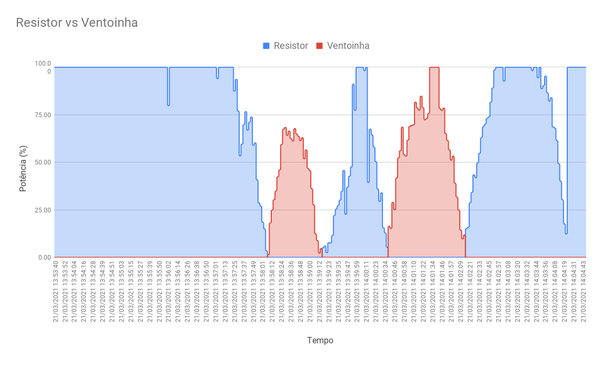

# FSE_Projeto1

O Projeto em questao busca realizar o controle de temperatura de um sistema isolado, acionando uma ventoinha para o resfriamento do sistema até a **Temperatura Externa** e um resistor para aquecer a **Temperatura Interna** até a **Temperatura de Referência**

## Execução

Para executar o programa basta clonar o repositório presente, entrar no diretório do repositório e executar os seguintes comandos

``` bash
$ make
$ make run
```

Após isso, aparecerá o terminal interativo, com a atualização - em média a cada 1 segundo - dos dados obtidos pelo sistema, bem como o estado da ventoinha e do resistor.

O Menu contém 3 opções, sendo elas:

* **1 - Inserir TR**, em que, quando o usuário digitar o número correspondente, acionará uma segunda tela para obter a nova **Temperatura de Referência (TR)**, que deve estar em uma faixa entre a **Temperatura Externa (TE)** medida no momento e 100 °C;

* **2 - Utilizar TR do Potenciômetro**, que passará a utilizar a **Temperatura de Referência (TR)** equivalente à lida pelo potenciômetro;

* **3 - Sair**, que encerrará o sistema, bem como as conexões gerais e desligará a ventoinha e o resistor.

## Resultados 

Ao executar o programa por 10 minutos, foram obtidos os segunites resultados do sistema de controle:

### Temperatura

Ao longo do período de 10 minutos, a **Temperatura Interna (TI)** foi alterada de acordo com o valor indicado pela **Temperatura de Referência (TR)** obtida pelo potenciômetro, nao ultrapassando a **Temperatura Externa (TE)** que se referia à temperatura ambiente no local de execução do Experimento.


### Ventoinha e Resistor

Nesse mesmo período de tempo é Interessante observar o gráfico de acompanhamento do Resistor e da Ventoinha, observando como a intensidade de acionamento (em Módulo) desses elementos indicaram a tendência de modificação da temperatura ao longo do tempo



### Geral

De uma forma geral, é possível notar o funcionamento do sistema ao se comparar os valores absolutos em um mesmo gráfico, ainda que com um excesso de informações, mostrando como a atuação tanto do resistor quanto da ventoinha influenciaram no sistema e com que intensidade ocorreu essa influência.


